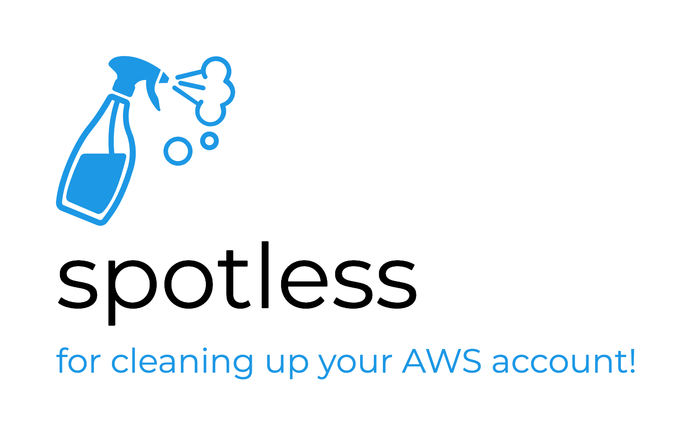

# spotless

## running the cleanup

1) Make sure you have AWS credentials on your machine
2) `npm install`
3) `chmod +x ./src/delete-everything.ts`
4) `./src/delete-everything.ts`

## features

- Currently Supported
  - delete all Lambda functions and function versions
  - delete all ENIs
- Coming Soon
  - delete all resources in an AWS account
  - resource exclusion filters
  - post-cleanup hooks
